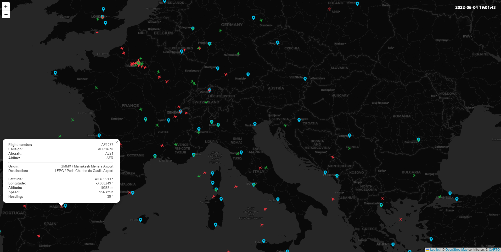

# flight-tracker-simulator
Simulation of a flight tracking system consuming real time flight position events, handling aeronautical data in micro-services and displaying those data on a map.

## How it works

- Flight position events are generated and published to a RabbitMQ instance by the event producer service.
- Those position events are consumed by
  - The flight status service which
    1. Update the current position of the associated flight in its internal database.
    1. Expose the position and their updates in near real-time with server-sent events.
  - The flight position history service
    1. Historize the position of the associated flight in its internal database.
    2. Expose the past positions of the flights in REST.

- Airport data (names and coordinates) are exposed with a REST api by the airport service.

- Flight data (departure, arrival, aircraft...) are exposed with a REST api by the flight service.

- A UI allows the visualization
  - of the current position of each aircraft on a map.
  - of the past position of each aircraft on a map.


## Prerequisites
- Docker
- Docker compose


## Usage

Run the simulation by running
```
docker compose up
```

The UI of the simulation is available at `http://localhost:3000`.


